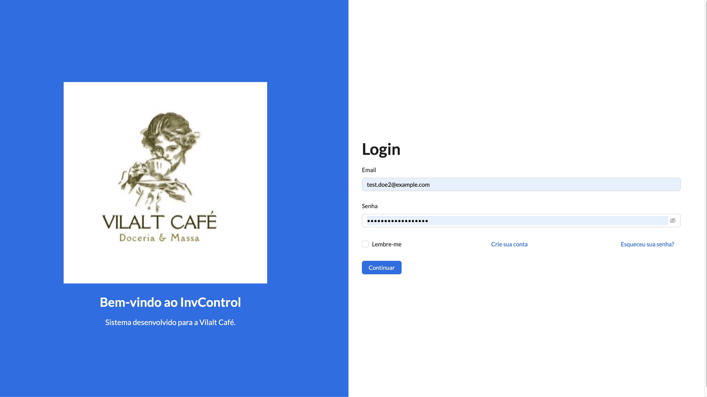
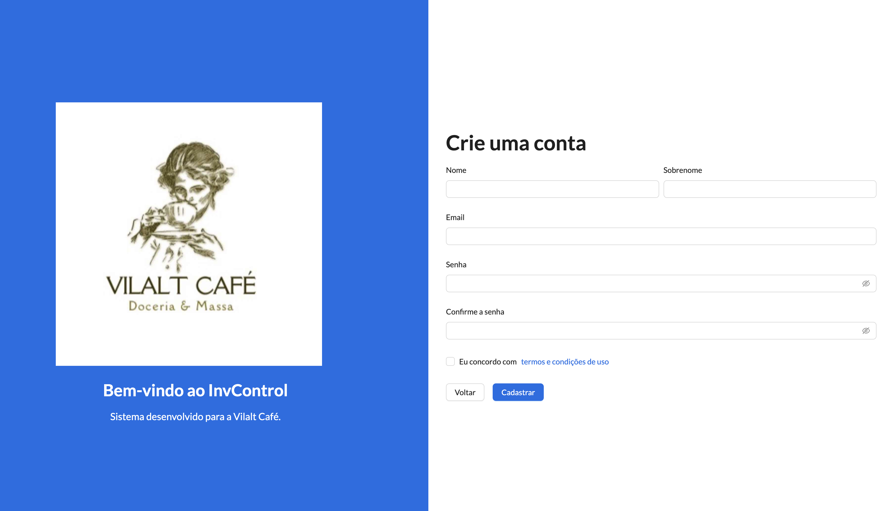
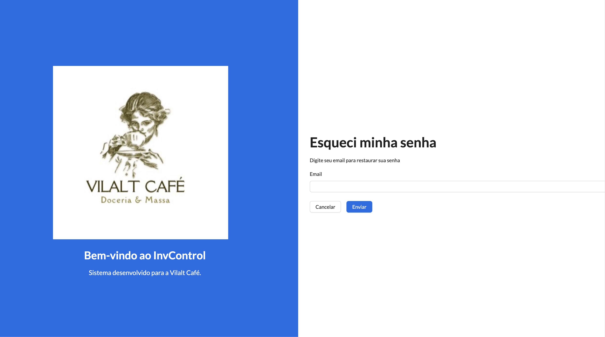
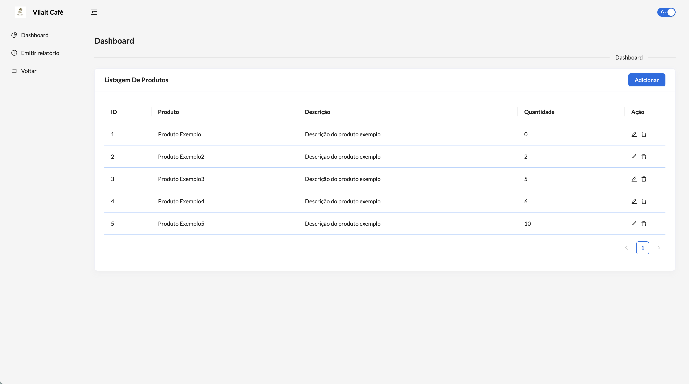
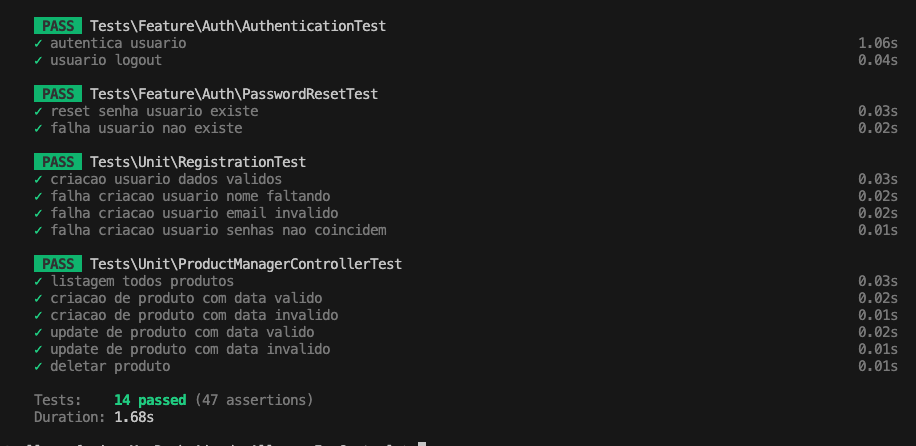

<h1>InvControl - Dashboard de Gerenciamento de Estoque</h1>

Este projeto é um dashboard para gerenciamento de estoque, desenvolvido com Laravel no backend e React no frontend.

<h2>Interface do Frontend</h2>

Login:

Criar conta:

Esqueci a senha:

Dashboard:

<h2>Testes Unitários</h2>

Testes unitários executados no Laravel:

<h2>Tecnologias Utilizadas</h2>

    <h3>Backend:</h3>
    
Laravel 10x

    
    
    <h3>Frontend:</h3>
    
React com VITE e template <a href="https://github.com/design-sparx/antd-multipurpose-dashboard">antd-multipurpose-dashboard</a>

    
    

<h2>Procedimentos de Instalação</h2>

<h3>Backend</h3>
<ol>
    <li><strong>Banco de Dados</strong>: PostgreSQL</li>
    <li><strong>Pré-requisitos:</strong> 
        <ul>
            <li>Instalar <a href="https://www.apachefriends.org/index.html">XAMPP</a> (Windows) ou PHP (Linux, macOS).</li>
            <li>Instalar <a href="https://getcomposer.org/">Composer</a>.</li>
        </ul>
    </li>
    <li><strong>Instalação:</strong>
        <ul>
            <li>Clonar o projeto.</li>
            <li>Na raiz do projeto, executar:
                <pre><code>composer update</code></pre>
            </li>
        </ul>
    </li>
    <li><strong>Configuração do Banco de Dados:</strong>
        <ul>
            <li>Criar um banco de dados chamado <code>invcontrol</code> com senha <code>1234</code>.</li>
            <li>Executar as migrações com:
                <pre><code>php artisan migrate</code></pre>
            </li>
        </ul>
    </li>
</ol>

<h3>Frontend</h3>
<ol>
    <li>Navegar até a pasta do frontend <code>reactinvcontrol</code>.</li>
    <li>Executar o comando:
        <pre><code>cp .env.example .env</code></pre>
    </li>
    <li>Gerar a chave de autenticação do Laravel com:
        <pre><code>php artisan key:generate</code></pre>
    </li>
    <li>Ajustar o arquivo <code>.env</code> para incluir apenas <code>APP_KEY</code> e as configurações do banco de dados.</li>
    <li>Instalar as dependências com:
        <pre><code>npm run install:legacy</code></pre>
    </li>
    <li>Configurar a rota do backend em <code>src/global.ts</code> (ajustes podem ser necessários para ambientes Windows).</li>
    <li>Executar o projeto:
        <pre><code>npm run dev</code></pre>
    </li>
</ol>

